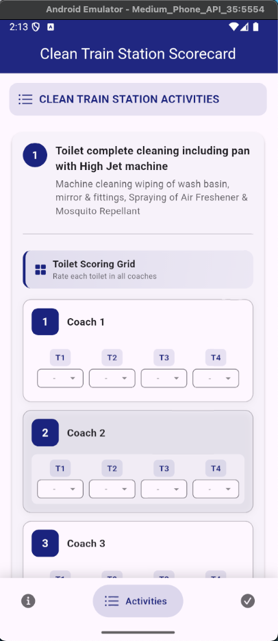

# Clean Train Station Scorecard - Flutter Application

A comprehensive Flutter application for railway station cleanliness inspection and scoring. This digital scorecard allows inspectors to evaluate and record cleanliness parameters across different station areas through an intuitive mobile interface.

## 📱 Screenshots

<p float="left">
  
   
  
</p>

## 🚀 Features Implemented

### Core Functionality
- **Digital Form Management**: Complete digital transformation of paper-based railway cleanliness scorecard
- **Multi-Section Scoring**: 
  - Toilet cleaning (T1-T4 for each of 13 coaches)
  - Outside washbasin cleaning (13 coaches)
  - Vestibule/Doorway areas (B1, B2, D1, D2 for each coach)
  - Waste disposal (13 coaches)
- **Real-time Score Calculation**: Automatic percentage calculation based on scores entered
- **State Management**: Implemented using Provider pattern for efficient data handling
- **Form Validation**: Ensures all required fields are filled before submission
- **API Integration**: Mock API submission to httpbin.org/post

### UI/UX Features
- **Responsive Design**: Adapts to different screen sizes with dynamic grid layouts
- **Theme Support**: Full support for light and dark themes
- **Modern Navigation**: Google Nav Bar (GNav) for smooth tab transitions
- **Visual Feedback**: 
  - Color-coded scoring (Green: 8-10, Orange: 5-7, Red: 1-4)
  - Progress indicators for each section
  - Animated transitions between screens
- **Intuitive Scoring**: Dropdown menus with visual indicators for scores, 'X' for inaccessible, '-' for not available

### Technical Features
- **Clean Architecture**: Organized folder structure with separation of concerns
- **Reusable Components**: Custom widgets for consistent UI across the app
- **Error Handling**: Comprehensive error handling for form submission
- **Data Persistence**: In-memory storage during form completion
- **JSON Serialization**: Proper data formatting for API submission

## 📋 Prerequisites

- Flutter SDK: >=2.19.0 <3.0.0
- Dart SDK: >=2.19.0 <3.0.0
- Android Studio / VS Code with Flutter extensions
- An Android/iOS device or emulator

## 🛠️ Setup Instructions

### 1. Clone the Repository
```bash
git clone https://github.com/anas4519/ss_task.git
cd ss_task
```

### 2. Install Dependencies
```bash
flutter pub get
```

### 3. Run the Application

#### For Development
```bash
flutter run
```

#### For Release Build
```bash
# Android
flutter build apk --release

# iOS
flutter build ios --release
```

### 4. Configure API Endpoint (Optional)
To use a custom API endpoint, edit `lib/services/api_service.dart`:
```dart
static const String apiUrl = 'https://your-api-endpoint.com/submit';
```

## 📁 Project Structure

```
clean_train_scorecard/
├── lib/
│   ├── main.dart                    # Application entry point
│   ├── models/
│   │   └── scorecard_data.dart      # Data models
│   ├── providers/
│   │   └── scorecard_provider.dart  # State management
│   ├── screens/
│   │   ├── scorecard_screen.dart    # Main screen with navigation
│   │   ├── basic_info_tab.dart      # Basic information form
│   │   ├── activities_tab.dart      # Activity scoring interface
│   │   └── review_tab.dart          # Review and submission
│   ├── widgets/
│   │   ├── activity_widgets/        # Activity-specific widgets
│   │   │   ├── toilet_scoring.dart
│   │   │   ├── coach_scoring.dart
│   │   │   ├── door_scoring.dart
│   │   │   └── score_dropdown.dart
│   │   ├── custom_text_field.dart
│   │   └── review_row.dart
│   └── services/
│       └── api_service.dart         # API communication
├── pubspec.yaml                     # Dependencies
└── README.md                        # This file
```

## 🔧 Configuration

### Dependencies Used
- **provider**: ^6.0.5 - State management
- **http**: ^0.13.6 - API calls
- **intl**: ^0.18.1 - Date formatting
- **google_nav_bar**: ^5.0.6 - Bottom navigation

## 📊 Data Flow

1. **Input Collection**: User enters data through forms in Basic Info and Activities tabs
2. **State Management**: Provider pattern maintains form state across screens
3. **Validation**: Form validation ensures data integrity
4. **Review**: All data displayed for verification before submission
5. **Submission**: JSON formatted data sent to API endpoint

### JSON Output Format
```json
{
  "workOrderNo": "string",
  "date": "ISO 8601 date",
  "nameOfWork": "string",
  "contractor": "string",
  "supervisor": "string",
  "trainNo": "string",
  "arrivalTime": "string",
  "departureTime": "string",
  "totalCoaches": 13,
  "totalScorePercentage": 85.5,
  "activityScores": {
    "toilet_cleaning": {
      "activityName": "Toilet complete cleaning...",
      "scores": {
        "C1-T1": "8",
        "C1-T2": "9",
        ...
      },
      "remarks": "string"
    },
    ...
  }
}
```

## ⚠️ Assumptions & Known Limitations

### Assumptions
1. **Fixed Coach Count**: The application assumes exactly 13 coaches per train
2. **Scoring Scale**: Uses 0-10 scoring scale as per the original form
3. **Activity Types**: Four fixed activity types based on the provided scorecard
4. **Network Availability**: Assumes internet connection for form submission
5. **Single Train Inspection**: One scorecard per train inspection session

### Known Limitations
1. **Offline Support**: No offline data persistence - data lost if app closes
2. **Bulk Operations**: Limited bulk scoring options (only in coach scoring)
3. **Photo Attachments**: No support for adding photos to inspections
4. **Multi-language**: Currently only supports English
5. **Export Options**: No PDF/Excel export functionality
6. **Historical Data**: No viewing of previously submitted scorecards
7. **User Authentication**: No login/user management system

### Future Enhancements
- Offline mode with local database
- Photo attachment for evidence
- Bulk scoring operations
- Export reports as PDF/Excel
- Multi-language support
- Historical data viewing
- User authentication and roles
- Dashboard with analytics
- Signature capture for supervisors

